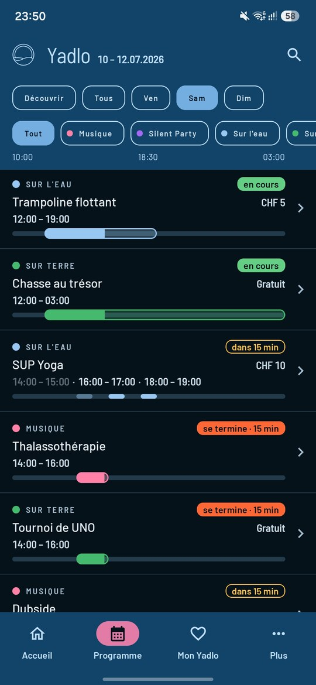
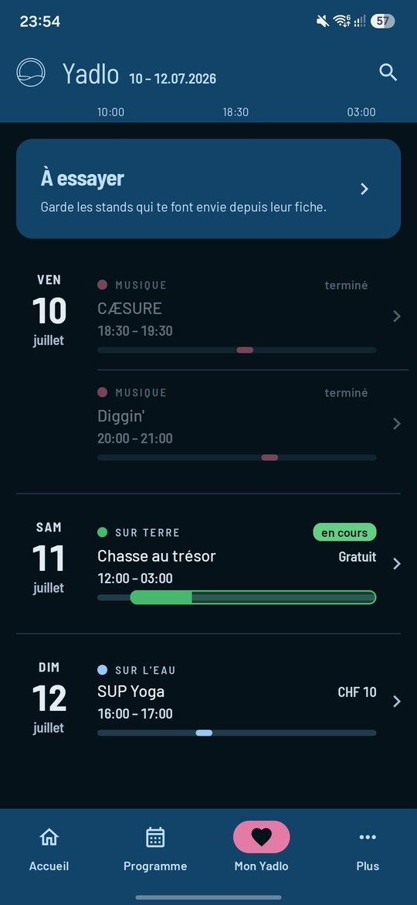
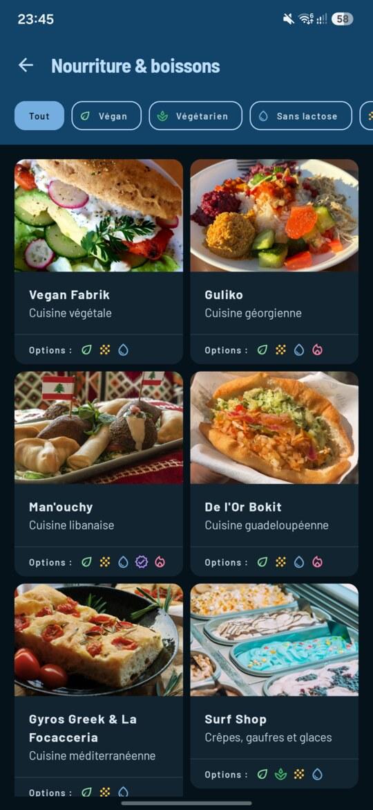
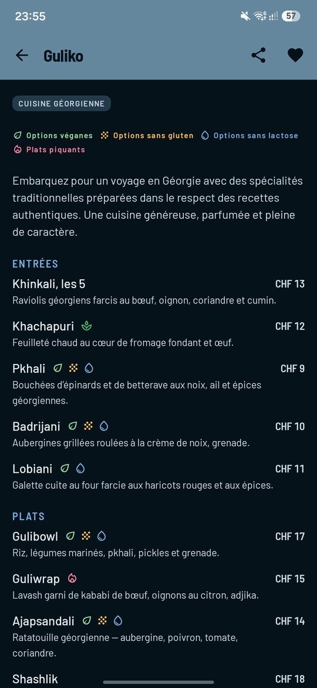

# Yadlo

A Kotlin Multiplatform / Compose Multiplatform companion app for **[Yadlo](https://yadlo.ch)** —
a three-day lakeside music, sport and beach festival held at Préverenges (Vaud, Switzerland)
each July since 2015. Android and iOS from one shared codebase.

The festival's information has never existed as structured data: it lives in a page-builder
website, much of it baked into images, with no prices, no menus and no way to keep track of
what you want to see. This app is the first place the programme, the activities, the stands and
the practical information are modelled as data — which is what makes a personal schedule,
reminders and full offline access possible at all.

Four tabs — **Accueil · Programme · Mon Yadlo · Plus** — over a single content model, with the
whole app reshaping itself around where the year is (off season, announced, approaching, live,
ended).

> **Status:** unofficial project, aiming to become the official app for the 2027 edition.
> All four tabs are built. See [SPEC.md](SPEC.md) for the full plan and what is deliberately out of scope.

---

## ✨ Features

- 🏠 **Accueil**
    - A block stack that reshapes itself with the Phase: countdown out of season, announcements as
      they land, a live companion during the weekend, a thank-you on the Monday
    - The Phase is derived from the clock, never flipped by hand
    - Global search from the toolbar
- 🗓️ **Programme**
    - One chronological list per day, behind a *Découvrir · Tous · Vendredi · Samedi · Dimanche*
      selector
    - Live state written on every slot: starting soon, running with progress, ending, over
    - Filter by kind: music, water, land, children, Silent Party
    - During the festival it opens on the day you are standing in, scrolled to now
- ❤️ **Mon Yadlo**
    - One tap on the row you are already reading saves that specific date, with no dialog asking
      which one you meant
    - Saved slots on a rail grouped by day, the date pinned left and the time written once
    - A local reminder before each saved slot
    - Food stands saved separately and grouped by what they sell, so they never clutter the timetable
- 🔍 **Recherche**
    - One screen over one corpus: the programme and the practical information together
    - A result is a thing rather than an occurrence, so an activity running all three days appears
      once and lists its dates
- 📄 **Fiches**
    - One template for Artist, Activity and Stand: a collapsing toolbar over a photo
    - Menus with prices, dietary marks on individual dishes, and last year's prices marked
      unconfirmed rather than quietly shown as fact
    - Share as plain text that still works for a recipient without the app
- ➕ **Plus**
    - An iOS-style grouped list: *Sur place · Le festival · S'impliquer · Réglages*
    - The cashless notice, bus lines and night departures, parking, the site map
    - A notification switch, and a screen that clears the saved plan and the image cache
- 📴 **Offline**
    - The whole programme and every practical fact answerable with no signal, because the site runs
      on one saturated cell tower
    - Previously viewed images kept in a disk cache

---

## 🖼️ Showcase

          

*Accueil during LIVE · the Programme opened on the day you are standing in, with every live state
written out · a saved plan on the rail · an activity fiche and its three dates, one of them saved ·
the stands grid with its dietary filters · a menu with prices and per-dish marks.*

---

## 📚 Project documents

| Document | What it holds |
|---|---|
| [SPEC.md](SPEC.md) | The spec: problem statement, 80 user stories, implementation and testing decisions, scope boundary. Links every UI prototype. |
| [CONTEXT.md](CONTEXT.md) | The domain glossary — the vocabulary used in code and in conversation. |
| [DECISIONS.md](DECISIONS.md) | The long-form record of every decision, including the alternatives that were rejected and why. |
| [CLAUDE.md](CLAUDE.md) | Working guidance for agents, plus the current state of the fork. |

---

## 🧱 Tech Stack

### 🧩 Architecture
- Clean Architecture (Data, Domain, Presentation layers)
- MVI with MVIKotlin (StoreFactory, Executor, Reducer pattern)
- UseCase-driven domain interaction, reserved for logic that touches a port (a repository, a clock) — a UseCase that would just forward to a single pure domain call doesn't exist
- Each repository juggles a remote (Ktor) and local (SQLDelight) data source, with neither leaking past the repository boundary
- Konsist for structural architecture enforcement, organized by rule category rather than by layer, including rules that enforce **test coverage itself**

### 🛠 Libraries
- [Compose Multiplatform](https://www.jetbrains.com/lp/compose-multiplatform/) — shared UI for Android and iOS
- [Kotlin Multiplatform](https://kotlinlang.org/docs/multiplatform.html)
- [MVIKotlin](https://arkivanov.github.io/MVIKotlin/) — MVI framework
- [Koin](https://insert-koin.io/) — dependency injection
- [Navigation 3](https://developer.android.com/guide/navigation/navigation-3) — KMP-compatible artifacts, type-safe `NavKey` destinations
- [Ktor](https://ktor.io/) — remote data sources
- [SQLDelight](https://cashapp.github.io/sqldelight/) — local data sources
- [Coil3](https://coil-kt.github.io/coil/) — image loading, wired to the shared Ktor `HttpClient`
- [Compose Multiplatform resources](https://www.jetbrains.com/help/kotlin-multiplatform-dev/compose-multiplatform-resources.html) — shared strings across platforms
- [Konsist](https://docs.konsist.lemonappdev.com/) — architecture test enforcement
- [Turbine](https://github.com/cashapp/turbine) — Flow/Label testing
- [ktlint](https://pinterest.github.io/ktlint/) + [ktlint-compose-rules](https://mrmans0n.github.io/compose-rules/)
- [Husky](https://typicode.github.io/husky/) + [Commitlint](https://commitlint.js.org/) — conventional commit enforcement via Git hooks

---

## 📁 Project Structure

```
shared/
├── app/                              # Composes the whole application; imports everything,
│   ├── App.kt                        #   and nothing imports it
│   ├── di/{KoinInitializer,AppModule}.kt
│   ├── navigation/  notification/  debug/
│   └── shell/                        # the screens outside the four tab stacks
├── design/                           # How Yadlo looks: tokens, and components whose
│   └── {component,preview,theme,uimodel}/   #   contract is purely presentational
├── core/                             # The subject matter: the festival, the plan, the reminders
│   └── {content,plan,reminder,error,time}/
├── feature/                          # Vertical slices: data + domain + presentation each
│   └── {home,programme,monyadlo,plus,happening,search}/
└── infra/                            # Reusable plumbing, zero feature knowledge
    ├── database/  format/  image/  mvi/  navigation/  network/  notification/  platform/  text/  time/
androidApp/                           # Android application module
iosApp/                               # iOS application module
konsistTest/                          # Architecture + coverage enforcement tests
```

Yadlo feature slices: `home` (Accueil), `programme`, `monyadlo` (Plan + Wishlist),
`happening` (the shared fiche template for Artist / Activity / Stand), `plus`, and `search`
(one index over the whole edition, reached from Accueil and from the toolbar).

---

## 🏛 Architecture Decisions

Five top-level packages, each with a distinct responsibility: `app/` composes the whole
application and is the only place allowed to know about more than one feature at once — it
imports everything and nothing imports it; `infra/` is reusable technical plumbing with zero
domain or feature knowledge; `design/` is the visual language, tokens and components whose
contract is purely presentational; `core/` models the subject matter — the festival, the
visitor's plan, their reminders — and is named for what a file is rather than for how many
callers it has; `feature/` holds vertical feature slices, each owning its full
data/domain/presentation stack and never reaching into another feature's internals.

Each feature follows Clean Architecture layering with an MVI presentation layer (MVIKotlin's
Store/Executor/Reducer), a strict `State` (internal) vs. `UiModel` (what the Composable actually
renders) split, Koin for dependency injection, Navigation 3 for routing, and a matching Konsist
rule for nearly every convention above — this repo treats "documented but not enforced" as
equivalent to "not true."

For the full rule set see [`agents/agent-architecture-convention.md`](agents/agent-architecture-convention.md).
For the product-level decisions — content architecture, phase derivation, screen layouts,
interaction rules, visual identity — see [SPEC.md](SPEC.md) and [DECISIONS.md](DECISIONS.md).

---

## 🚀 Setup

Requires [Node.js](https://nodejs.org/) (for the Git hooks) and the Android SDK.

```bash
npm install
```

`local.properties` must point at your Android SDK (`sdk.dir=...`). For iOS, set `TEAM_ID` in
`iosApp/Configuration/Config.xcconfig`.

---

## ✅ Commit Conventions

This project uses **Husky** and **Commitlint** to enforce
[Conventional Commits](https://www.conventionalcommits.org/) at commit time.

**Format:** `<type>(<scope>): <description>`

- **Types:** `feat`, `fix`, `refactor`, `build`, `chore`, `ci`, `docs`, `perf`, `style`, `test`, `revert`.
- **Scopes:** `network`, `database`, `content`, `notification`, `di`, `navigation`, `theme`, `core`, `gradle`, `deps`, `home`, `programme`, `mon-yadlo`, `happening`, `plus`, `search`.
- A scope is **required** for `feat`, `fix`, `refactor`, and `build`.

Example: `feat(programme): add a category filter to the day list`

> [!IMPORTANT]
> The scope list lives in three places — `commitlint.config.js`, this README, and
> [`agents/agent-commit-convention.md`](agents/agent-commit-convention.md) — and they have
> drifted apart before. Update all three together.

For the full deterministic `type`/`scope` decision procedure, see
[`agents/agent-commit-convention.md`](agents/agent-commit-convention.md).

---

## 🧪 Running Tests

```bash
./gradlew :konsistTest:test
```

```bash
./gradlew :shared:testAndroidHostTest
```

```bash
./gradlew ktlintCheck
```

---

## 🧑‍💻 Author

**Nicolas Zurbuchen**  
Android Software Engineer based in Tokyo, Japan  
Contact: [nicolas.zurbuchen@outlook.com](mailto:nicolas.zurbuchen@outlook.com)
